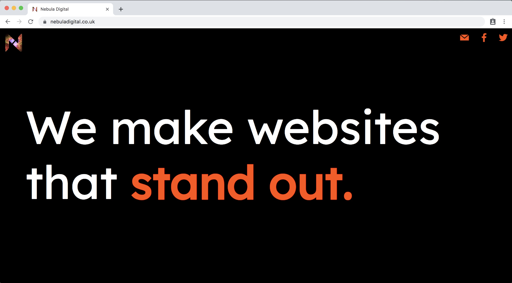

# [Nebula Digital website](https://nebuladigital.co.uk/)
Coded by [George Drayson](https://github.com/GeorgeDrayson)

  

## Tech Stack

#### Written in
* HTML & CSS
* Javascript

#### Libraries
* jQuery

## Getting started

1. Fork and clone this repository
2. In the main folder type:
  ```
  open index.html
  ```
And then your default browser will open the website locally
